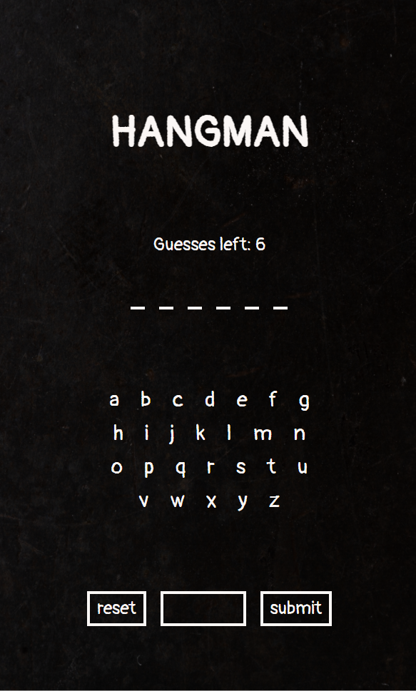

# JavaScript Hangman

  

### Author - Reuben George
A chalkboard-based hangman game.

## General Info
This javascript game was made during the fourth week of my _nology course where we were taught more about functions and DOM manipulation along with testing, aspects of which I've implemented within my own code-writing.

### Technologies used
HTML, CSS, SCSS, JavaScript

### Design Inspiration
The inspiration for me was to have a clean blackboard design for hangman similar to emulate the more nostalgic classic game.

## How it works

The user inputs their guess using a keyboard/mobile keyboard and clicks sumbit. So first the guessed letter will be removed from the letters array below the guess word.

Then based on their guess two actions occur; if it's a correct guess then the letter will be revealed within the word. If it's an incorrect guess, the guesses left number will decrement.

The game is won when all the letters have been guessed correctly before the guesses left number reaches zero.

The game is lost when the guesses left counter reaches zero before the word has been guessed.

## The code

### Helper functions
- `setGuessCounter()`: sets the guessLeft to the counter innerHTML
- `setBlankSpaces()`: sets the blank spaces to guess the word
- `getCorrectGuessIndex()`: returns the indices of the correct guess within the word array
- `showGuess()`: displays the letter above a dash after it's been correctly guessed
- `removeLetter()`: removing the letter from the letter display if it's been guessed
- `isCorrectGuess()`: returns true or false based on whether it's a correctly guessed letter
- `isNotNewGuess()`: returns true if the guess is included within the total guesses array
- `hasWon()`: returns true if the game has been won (based on whether the array with the correct guesses is the same length as the word array)
- `setGameEndMsg()`: used to display a message at the end of the game, the message is customisable based on the parameter included
- `decrementCount()`: returns guesses left - 1 unless the guesses left is zero, then it just returns the original input
- `resetVariable()`: used to reset any variable based on their type

### Main functions
- `gameInit()`: function used to initialise the game and set the board
- `handleClickGuess()`: function attached to the submitBtn used to enter the letter guess and display on the board based on whether it's a correct guess or not
- `handleClickReset()`: function used to reset the board and game (not totally functioning yet as the guesses left doesn't display again once the board has been reset)

## Future implementation
I think the next step would have me animating a stick hangman graphic which dynamically changes based on the number of guesses left.